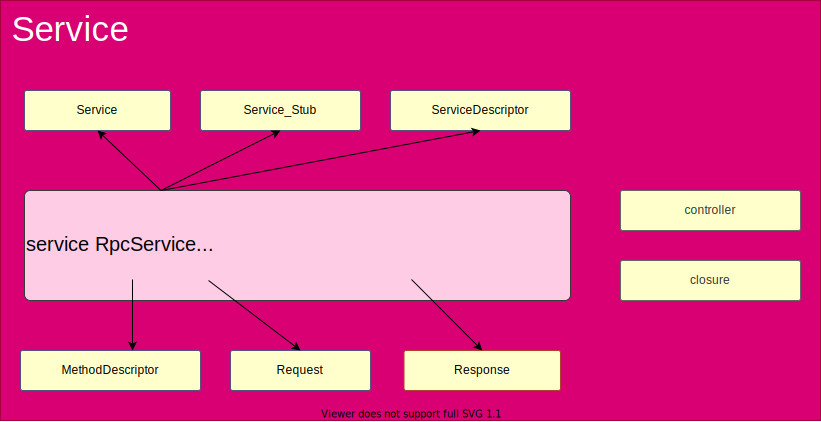
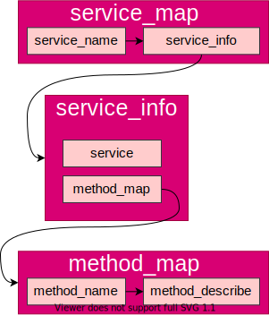

    


# 1 概述

mpzRPC是基于C++实现的RPC分布式网络通信框架，框架基于muduo高性能网络库、protobuf数据交换、Zookeepr服务注册中间件开发，即mpzRPC。mpzRPC在客户端隐藏了通信和连接过程，在服务端提供了简洁本地服务发布注册接口，整体高效易用。

#### 设计思路 

protofbuf原生提供了基于rpc service方法调用代码框架，无需实现对服务接口的描述，只需要关注服务管理和rpc通信流程；其次，protobuf基于二进制序列化数据的，同带宽具有更高的通信效率；因此，采用protobuf为基础，整体框架初始构想如下；



灰色区域由protobuf提供，红色区域是框架的待开发部分：

- 服务映射表：记录服务端发布的本地服务名称和服务对象；当客户端发起调用时，输入RPC方法名->查表->取服务对象->调用；
- 服务注册中间件：服务端在将发布的服务进行注册，客户端根据服务、方法名从服务注册中间件获取服务所在机器的URL，从而定位通信对象；
- 网络中间件：RPC请求的发送和服务调用响应的返回，需要网络中间件实现客户端和服务端的通信；
- 通信协议：客户端调用一个远程RPC服务，需要提供服务名称、方法名称、方法输入参数，因此客户端打包这些参数和服务端解包需要提前约定一个通信协议；

#### 设计实现


- 服务映射表：由provider类->publicService实现本地服务发布为RPC服务；
- 服务注册中间件：利用Zookeeper的服务注册功和发现能，具有两方便优势，其一，客户端和服务端解耦，客户端无需手动修改服务URL配置文件；其二，提供者和服务中心间存在心跳检测和服务协调，实时检测更新提供服务的URL；
- 网络中间件：采用muduo网络库实现通信，muduo库采用one loop per thread设计，多线程并发执行多个事件循环，每个事件循环采用非阻塞+epoll作为IO模型，性能优秀；
- 通信协议：head_size+head_str+request_str设计，其中head_str中包含request_size信息，避免Tcp粘包；

#### 交互流程

1. 发布本地服务，在服务端，通过provider->publishService将本地服务封装成可被远程调用的rpc服务，并添加到服务映射表；
2. 启动服务，provider->run启动TcpServer,并创建一个监听fd->acceptFd；将服务映射表上的RPC服务注册到ZooKeeper;
3. 客户端发起调用，根据目标服务名、方法名，从ZooKeeper上获取RPC方法所在URL；按通信协议打包数据包，序列化后通过clientFd连接TcpServer,发送数据包；
4. 建立连接，当客户端连接acceptFd成功时，acceptFd返回connFd与clientFd组成TCP链路，并创建对应TcpConnection对象；
5. 服务端接收数据，客户端发送数据包写入服务端connFd读缓冲区时，触发TcpConnection对象的onMessageCallback回调；
6. 服务端解包，在onMessageCallback回调中，反序列化后，按通信协议解包，通过包中rpc方法名查服务映射表获取对应service、MethodDescribe对象,通过包中request_str构建Request对象；
7. 服务端绑定回调，将provider的sendResponse设置为callMethod中的closure关闭回调对象；
8. 服务端调用，在onMessageCallback回调中，service对象->callMethod->执行rpc method->执行local method->返回值写入Response对象->触发关闭回调sendResponse；
9. 服务端返回，sendResponse中将response序列化后返回客户端，客户端clientFd通过recv接收并反序列化后从response对象中获取调用结果，至此完成一轮rpc调用，关闭Tcp连接；

# 2 安装

#### 安装依赖库

- [protobuf](https://github.com/protocolbuffers/protobuf)
- [ZooKeeper](https://github.com/apache/zookeeper)
- [muduo](https://github.com/chenshuo/muduo)
- [cmake](https://github.com/Kitware/CMake)
- [json](https://github.com/nlohmann/json)

#### 编译

```shell
# 克隆
git clone https://github.com/wangzyon/mpzRPC
# 编译
cd ./mpzRPC && sudo ./autobuild.sh
```

# 3 使用

<!-- tabs:start -->

#### 定义RPC接口

```protobuf
// protobuf版本
syntax = "proto3"; 
// 包名，在C++中表现为命名空间
package example;
// 生成service服务类的描述，默认不生成
option cc_generic_services=true;
// 状态
message ResultCode
{
    int32 errcode = 1;
    bytes errmsg = 2;
}
// 请求
message LoginRequest
{
    bytes name=1;
    bytes pwd=2;
}
// 响应
message LoginResponse
{
    ResultCode result=1;  // 复合message
    bool success = 2;
}
// 定义RPC接口
service UserRpcService
{
    rpc Login(LoginRequest) returns(LoginResponse);
}
```

#### 发布RPC服务

```cpp
#include <iostream>
#include <mpzrpc/mpzrpcapplication.h>
#include <mpzrpc/mpzrpcprovider.h>
#include "example.service.pb.h"

class UserService : public example::UserRpcService
{
public:
    
    bool Login(const std::string &name, const std::string pwd) // 本地服务
    {
        std::cout << "local service: Login" << std::endl;
        std::cout << "name:" << name << "pwd" << std::endl;
        return pwd == "123";
    }
    void Login(::google::protobuf::RpcController *controller, // RPC服务
               const ::example::LoginRequest *request,
               ::example::LoginResponse *response,
               ::google::protobuf::Closure *done)   
    {
        // 框架给业务上报了请求参数LoginRequest，应用获取相应数据做本地业务
        std::string name = request->name();
        std::string pwd = request->pwd();
        // 做本地业务
        bool ret = Login(name, pwd);
        response->set_success(ret);
        // 把响应写入，包括错误码、错误消息、返回值
        example::ResultCode *result_code = response->mutable_result();
        result_code->set_errcode(0);
        result_code->set_errmsg("");
        // 执行回调操作, 执行响应对象数据的序列化和网络发送（都是由框架来完成的）
        done->Run();
    };
};

int main(int argc, char **argv)
{
    MpzrpcApplication::init(argc, argv);  
    std::cout << MpzrpcApplication::getApp().getConfig().getRpcServerIp() << std::endl;
    MpzrpcProvider provider; 
    provider.publishService(new UserService()); // 2.发布服务（将本地Login发布为RPC Login）
    provider.run(); // 3.启动服务
    return 0;
};
```

#### 调用RPC服务

```cpp
#include <iostream>
#include "example.service.pb.h"
#include <mpzrpc/mpzrpcchannel.h>
#include <mpzrpc/mpzrpcapplication.h>

int main(int argc, char **argv)
{	
    // 1.初始化框架 
    MpzrpcApplication::init(argc, argv); 
    // 2.在客户端创建服务调用类对象stub
    example::UserRpcService_Stub stub(new MpzrpcChannel()); 
    // 3.创建RPC调用的请求对象和响应对象；
    example::LoginRequest request;
    request.set_name("zhang san");
    request.set_pwd("123456");
    example::LoginResponse response;
    // 4.调用
    stub.Login(nullptr, &request, &response, nullptr);
    // 5.打印响应结果
    if (0 == response.result().errcode())
    {
        std::cout << "rpc login response success:" << response.success() << std::endl;
    }
    else
    {
        std::cout << "rpc login response error : " << response.result().errmsg() << std::endl;
    }
    return 0;
}
```

<!-- tabs:end -->

> 完整例程参考：[example](example/)

# 4 关键设计

#### 服务接口设计

protobuf文件编译后将生成一系列C++类型，从而实现便利的接口服务；



protobuf中service标识将生成如下C++类型：

| C++类            | 描述                                                         |
| ---------------- | ------------------------------------------------------------ |
| Service          | 服务类，服务端使用，可获取各方法的请求类型、方法的返回类型等； |
| Service_Stub     | 服务类，客户端使用，可获取各方法的请求类型、方法的返回类型等； |
| ServiceDescrible | 服务的描述类，记录服务的名称、服务里的方法数量、各方法的描述类等； |
| MethodDescrible  | 方法的描述类，记录方法的名称、方法所在服务描述等；           |
| Request          | Message类，rpc方法的输入类型；                               |
| Response         | Message类，rpc方法的返回类型；                               |

protobuf额外生成两个C++类型：

| C++类      | 描述                                                |
| ---------- | --------------------------------------------------- |
| Controller | 手动记录rpc调用过程状态，从而查询调用过程是否成功； |
| Closure    | 回调；                                              |

RPC调用无论客户端还是服务端，核心均是调用CallMethod方法；

```cpp
// 服务端：Service->CallMethod
// 客户端：Service_Stub->CallMethod

void CallMethod(
	const google::protobuf::MethodDescriptor *method,
	google::protobuf::RpcController *controller,
	const google::protobuf::Message *request,
	google::protobuf::Message *response,
	google::protobuf::Closure *done);
```

#### 发布服务设计

发布服务指将服务端的本地服务封装成RPC服务后，记录在服务映射表的过程，当获取客户端RPC调用请求时，根据服务名称和方法名称可通过查询服务映射表获取服务和方法对象，服务映射表采用map嵌套结构如下：



服务映射表C++代码设计 ：

```c++
struct ServiceInfo
{
	google::protobuf::Service *m_service;
	std::unordered_map<std::string, const google::protobuf::MethodDescriptor *> m_methodmap;
};

std::unordered_map<std::string, ServiceInfo> m_servicemap;
```

> 完整实现参考：[mpzrpcprovider.cc](src/mpzrpcprovider.cc)->pulishService

#### 异步日志设计

写日志信息到文件使用磁盘I/O，若直接放到RPC方法调用的业务中，会影响RPC请求->RPC方法执行->RPC响应整个流程的速度，因此在Looger日志模块和RPC业务之间添加一个消息队列作为中间件，Muduo只负责向消息中间件添加日志信息，在新线程中Logger模块从消息队列读日志信息，并执行IO磁盘操作，实现了写日志和磁盘IO操作的解耦；

> 异步指Muduo中业务线程不用等待日志写入文件，将日志信息添加到消息队列中，即可继续执行业务逻辑；



- 线程安全：多个线程同时操作消息队列，因此，在队列的push和pop方法中添加mutex锁保证线程安全；
- 线程通信：pop操作中，若消息队列为空，则一直等待，同时Muduo无法获取锁，而不能添加消息，此时造成死锁；因此，在push和pop间使用condition_variable条件变量实现线程通信，当push操作执行后，通知pop操作可以取锁执行；

> 完整实现参考：[lockqueue.h](include/lockqueue.h)
>
> 一个功能更加强大的消息中间件：**kafka**

#### 通信协议设计

客户端和服务端通信，为避免粘包，需要约定一个通信协议；



采用protobuf定义数据包头的数据结构：

```protobuf
// protobuf版本
syntax = "proto3"; 

// 包名，在C++中表现为命名空间
package rpcheader;

message rpcheader
{
    bytes service_name=1;
    bytes method_name=2;
    uint32 request_size=3;
}
```

header_size是一个int32_t类型值，表示header_str长度，header_str由rpcheader序列化产生，包含一个int32_t类型的request_size，即request_str长度，因此，可根据header_size和request_size确定数据包的边界，避免粘包。

> 采用int32_t类型记录包头大小，而非字符串类型，例如int32_t类型表示范围2^32-1，而4字节字符串表示范围时"0"~"9999"

<!-- tabs:start -->

##### 打包

```c++
// 设置包头
rpcheader::rpcheader header;
header.set_service_name(service_name);
header.set_method_name(method_name);
header.set_request_size(request_str.size());

// 序列化包头->header_str
std::string header_str;
if (!header.SerializeToString(&header_str))
{
	LOG_ERR("%s", "message header_str serialization failed");
	return;
}

// 4字节int32_t类型包头大小转换为4字节字符类型
uint32_t header_size = header_str.size();
std::string send_str;
send_str.insert(0, std::string((char *)&header_size, 4));

// 打包
send_str += header_str + args_str;
```

##### 解包

```c++
// 接收数据包
std::string recv_str = buffer->retrieveAllAsString();
// 从字符流中读取前4个字节的内容，即header_size
uint32_t header_size = 0;
recv_str.copy((char *)&header_size, 4, 0);
// 根据header_size读取数据头的原始字符流，反序列化数据，得到header_str
std::string header_str = recv_str.substr(4, header_size);
rpcheader::rpcheader header;
if (!header.ParseFromString(header_str))
{
	LOG_ERR("%s", "header str deserialization failed");
	return;
}
// 反序列化包头
std::string service_name = header.service_name();
std::string method_name = header.method_name();
uint32_t request_size = header.request_size();
// 获取rpc方法参数的字符流数据，即request_str
std::string request_str = recv_str.substr(4 + header_size, request_size);
```

<!-- tabs:end -->
